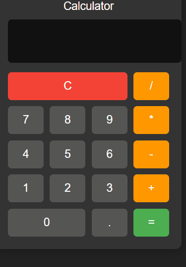

# Manar166-Assignment2
Assignment repo for assignment/1-2 (Assignment2)

in any browser (Chrome, Firefox, Edge).

---

## 📜 How It Works

### **HTML**
Defines the calculator layout and buttons.

### **CSS**
Creates the dark theme, button colors, and grid layout.

### **JavaScript**
Handles:
- Button clicks  
- Updating the display  
- Evaluating expressions  
- Resetting after "="  
- Preventing invalid input

---

## 🎥 Demo GIF

---

## 📌 Future Improvements

- Add keyboard support  
- Add scientific calculator mode  
- Add animations  
- Add sound effects  
- Add history panel  

---

## 👨‍💻 Author

**Manar**  
Building clean, scalable front‑end and back‑end solutions.

